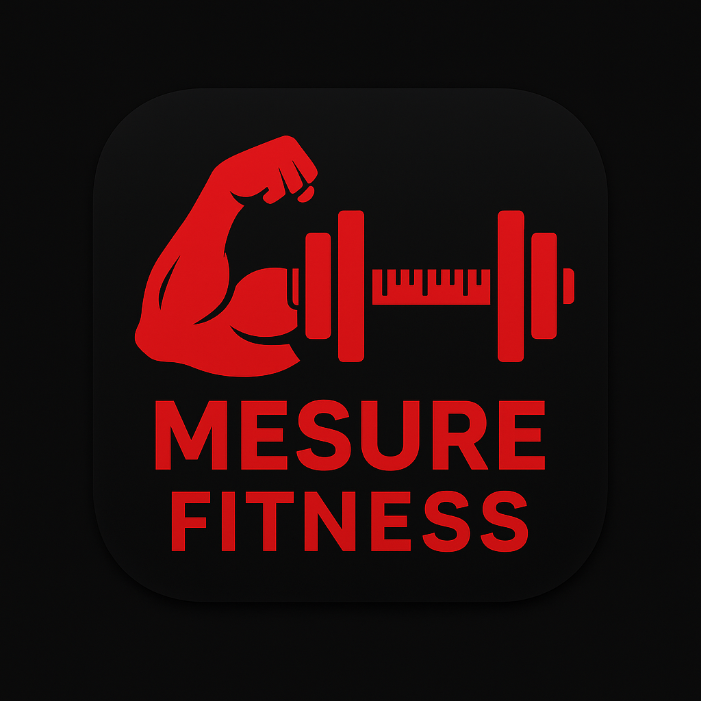
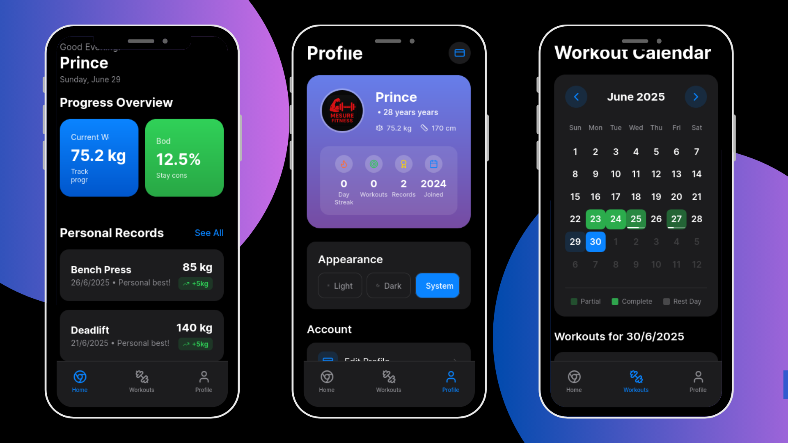

<p align="center">
  
</p>

# 🏋️‍♂️ Fitness Tracker App


A simple and efficient **React Native Fitness Tracker App** that helps you **store, manage, and monitor** all your essential fitness stats — such as **weight, height, deadlift records, and other workout metrics** — right from your mobile device.

---

## 📸 App Interface



---

## 🎯 Key Features

- 📏 **Body Stats Tracker**  
  Log your **height**, **weight**, and other key body measurements with ease.

- 🏋️ **Workout Logbook**  
  Keep track of your **exercise stats** (like Deadlift, Squat, Bench Press, etc.).

- 📊 **Progress Monitoring**  
  Track your physical progress over time with simple data views.

- 💾 **Offline First**  
  Fully functional without internet. All your data is stored securely using **NoSQL local storage** (AsyncStorage or equivalent).

- 🔐 **Privacy Focused**  
  No logins. No cloud sync. Your data stays on your device.

---

## 🚀 Built With

- ⚛️ **React Native** (with Expo)
- 💡 JavaScript
- 🗃️ **NoSQL Local Storage** (AsyncStorage)

---

## 🎥 App Demo (Video)

Watch the app in action:  
🔗 [LinkedIn Demo Video](https://www.linkedin.com/posts/prince-kumar-41659823b_reactnative-firstapp-mobiledevelopment-activity-7344783870426238976-bGlI?utm_source=share&utm_medium=member_desktop&rcm=ACoAADu1fVIBT8tjXBBLYpxDb6qcgmNAXlg2i74)

---


---

## 🛠 Setup & Installation

1. Clone the repository:

   ```bash
   git clone https://github.com/Prince000101/your-fitness-app.git
   cd your-fitness-app


2. Install dependencies:

   ```bash
   npm install
   ```

3. Run the app using Expo:

   ```bash
   npx expo start
   ```

---

## ✅ Roadmap / To Do

* [x] Track body stats and exercises
* [x] Store data locally using NoSQL
* [ ] Add charts and visual progress tracking
* [ ] Backup & export data
* [ ] Add reminder and goal-setting features

---

## 🤝 Contribute

Have ideas, suggestions, or want to collaborate?
Feel free to fork the repo and open a pull request. Contributions are welcome!

---

## 👤 Author

**Prince Kumar**
🔗 [LinkedIn Profile](https://www.linkedin.com/in/prince-kumar-41659823b)
🌐 [GitHub - Prince000101](https://github.com/Prince000101)

---

## 📃 License

Licensed under the [MIT License](./LICENSE)

---

