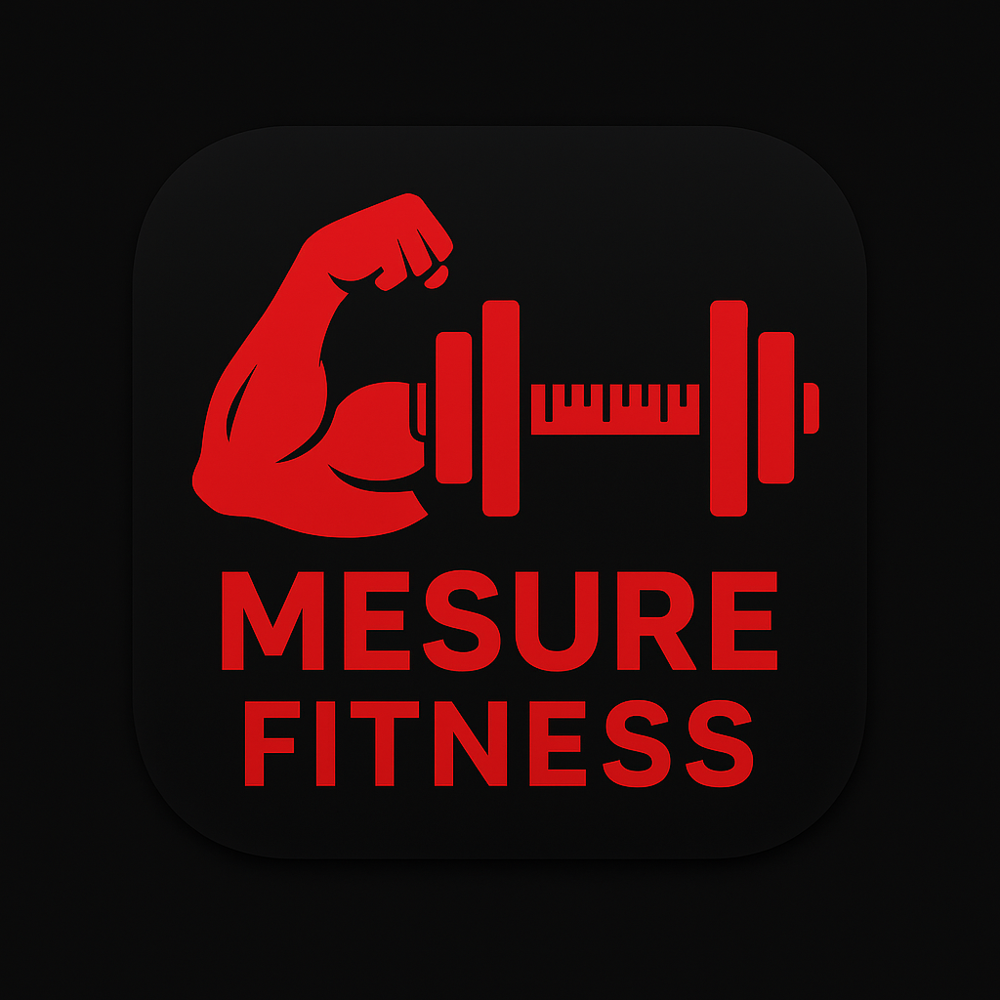

<p align="center">
  
</p>

# Measure Fitness
## React Native Fitness Tracker

A simple and efficient **React Native Fitness Tracker App** built with Expo that helps you **store, manage, and monitor** all your essential fitness stats — such as weight, height, personal records, and workout metrics — right from your mobile device with full offline support.

---

## Features

- **Body Stats Tracker** - Log weight, body fat, muscle mass, and body measurements
- **Workout Calendar** - Schedule routines, track completions with a visual calendar
- **Personal Records** - Track PRs for bench press, deadlift, squat, and more
- **Workout Sessions** - Run guided workout sessions with set tracking and rest timers
- **Fitness Goals** - Set and track progress toward fitness targets
- **Achievements** - Earn badges for milestones
- **Dark Mode** - Light/dark/system theme support
- **Offline First** - All data stored locally on device via AsyncStorage
- **Privacy Focused** - No logins, no cloud sync, data stays on your device

---

## Setup

```bash
git clone https://github.com/Prince000101/Mesure_Fittness_app.git
cd Mesure_Fittness_app
npm install
npx expo start
```

### Testing Options

| Method | Command | Requirements |
|---|---|---|
| **Web browser** | `npx expo start --web` | No extra tools |
| **Expo Go (phone)** | `npx expo start` | Expo Go app on iOS/Android |
| **Android emulator** | `npx expo start --android` | Android Studio |
| **iOS simulator** | `npx expo start --ios` | macOS + Xcode |

---

## Tech Stack

- **React Native** with Expo SDK 53
- **Expo Router** (file-based navigation)
- **AsyncStorage** (local NoSQL persistence)
- **TypeScript**
- **lucide-react-native** icons

---

## Project Structure

```
app/                  # Expo Router pages (file-based routing)
  (tabs)/             # Tab navigator screens
    index.tsx         # Home dashboard
    workouts.tsx      # Workout calendar
    profile.tsx       # Profile & settings
  workout-session.tsx # Active workout session
  personal-records.tsx
  body-measurements.tsx
  fitness-goals.tsx
  achievements.tsx
  create-workout-routine.tsx
  exercise-library.tsx
  workout-details.tsx
  progress.tsx
contexts/             # React Context providers
  ThemeContext.tsx     # Theme (light/dark/system)
  WorkoutContext.tsx   # Workouts, sessions, records, measurements
utils/storage.ts      # AsyncStorage helpers
components/           # Reusable UI components
types/                # TypeScript type definitions
```

---

## Author

**Prince Kumar**
- [LinkedIn](https://www.linkedin.com/in/prince-kumar-41659823b)
- [GitHub](https://github.com/Prince000101)

---

## License

MIT
